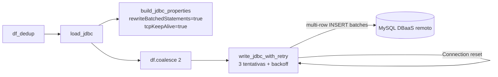

# Requirements

### Overview & Goals
The ETL pipeline fails at step 7/7 ("Carga dos Dados") with `java.sql.SQLNonTransientConnectionException: No operations allowed after connection closed` / `java.net.SocketException: Connection reset` when writing to the remote MySQL host (`savir005.vpshost12372.mysql.dbaas.com.br`).

**Root cause (from the stack trace and code):**
- The stack trace shows `ClientPreparedStatement.executeBatchSerially` — the MySQL driver flag `rewriteBatchedStatements` is **not enabled**, so every one of the 5000 rows per batch is sent as an individual network round trip over the internet. The load stage takes 6–10 minutes, and the shared DBaaS provider resets idle/long-lived connections mid-write.
- `load_jdbc()` in `etl_spark.py` opens **4 concurrent JDBC connections** (`num_partitions: 4`), which aggravates the connection limits of shared MySQL hosting.
- No retry: a single transient connection reset aborts the whole pipeline.

Goal: make the JDBC load fast (multi-row batched inserts), resilient (keep-alive + retries), and gentle on the shared host (2 connections), so `spark-submit ... etl_spark.py config_bigdata.json` completes successfully.

### Scope
**In Scope**
- Fix JDBC connection properties in `load_jdbc()` (`etl_spark.py`): `rewriteBatchedStatements`, `tcpKeepAlive`, larger `socketTimeout`.
- Explicitly coalesce the DataFrame to `num_partitions` (default **2**) before writing.
- Retry with exponential backoff around the JDBC write (3 attempts).
- Tune `config_bigdata.json`: `num_partitions: 2`, smaller `batch_size`, explicit `socket_timeout`.
- Unit tests for the new helpers.

**Out of Scope**
- Changing the target database or migrating to the local Docker MySQL (`docker-compose.yml`).
- Removing the plaintext password from `config_bigdata.json` (worth doing later — noted as a risk).
- Changes to extraction, mapping, cleaning, validation, or deduplication steps.

### Functional Requirements
1. `load_jdbc()` must enable `rewriteBatchedStatements=true` and `tcpKeepAlive=true` on the MySQL connection so batches are sent as multi-row `INSERT` statements (orders of magnitude fewer round trips).
2. The write must use at most `database.num_partitions` (default 2) concurrent connections, via an explicit `df.coalesce(...)`.
3. Transient connection failures (`Communications link failure`, `Connection reset`, `connection closed`) must be retried up to 3 times with exponential backoff.
4. All values (`batch_size`, `num_partitions`, `socket_timeout`, retry count) stay configurable through the `database` section of the config JSON.
5. Behavior for `parquet`/`delta` outputs and dimension loads (`load_dimensions()` also calls `load_jdbc`) must remain unchanged apart from the fixes above.

### Non-Functional Requirements
- The load stage should drop from ~6–10 minutes to well under a minute for the same dataset (multi-row batching over WAN).
- No new Python dependencies (retry implemented with stdlib `time`/`logging`).

# Technical Design

### Current Implementation
- `etl_spark.py:411-463` — `load_jdbc(df, config, table, mode)` builds `jdbc_properties` (`user`, `password`, `driver`, `batchsize`, `numPartitions`, `connectTimeout`, `socketTimeout`) and calls `df.write.jdbc(...)` once, with no retry and no MySQL batching flags.
- `etl_spark.py:545` — `load_dimensions()` reuses `load_jdbc` for each dimension table, so it benefits from the same fix.
- `config_bigdata.json` — `database.num_partitions: 4`, `database.batch_size: 5000`, no `socket_timeout` override (code default 60000 ms), remote DBaaS `jdbc_url`.
- `tests/test_etl_spark.py` — existing unittest suite with a shared local SparkSession; already imports `load_jdbc`.

### Key Decisions
- **Enable `rewriteBatchedStatements=true`** (driver property): converts per-row round trips (`executeBatchSerially` in the stack trace) into multi-row `INSERT`s. This is the primary fix — it removes the long WAN-bound write window during which the provider resets connections.
- **Coalesce to `num_partitions` (default 2), configured to 2** (user-confirmed): explicit `df.coalesce()` keeps the concurrent connection count predictable on shared hosting, instead of relying on the writer's implicit `numPartitions` handling.
- **Retry with exponential backoff, 3 attempts** (user-confirmed): safe because the fact-table write uses `truncate + overwrite` (idempotent) and dimensions are deduplicated before load.
- **Reduce `batch_size` to 1000**: with rewritten batches, one batch becomes one large packet; 1000 rows keeps packets safely under typical shared-hosting `max_allowed_packet` limits.
- **Raise default `socketTimeout` to 300000 ms and add `tcpKeepAlive=true`**: avoids client-side aborts on slow remote writes and keeps NAT/firewall paths alive.

### Proposed Changes
**`etl_spark.py`**
1. Extract a testable helper that builds connection properties:
```python
def build_jdbc_properties(db: dict) -> dict:
    """Monta as propriedades JDBC a partir da config 'database'."""
    password = _resolve_env_password(db.get("password", ""))
    return {
        "user": db.get("user", ""),
        "password": password,
        "driver": db.get("driver", "com.mysql.cj.jdbc.Driver"),
        "batchsize": str(db.get("batch_size", 1000)),
        "connectTimeout": str(db.get("connect_timeout", 30000)),
        "socketTimeout": str(db.get("socket_timeout", 300000)),
        # Correção: envia lotes como INSERT multi-linha (evita 1 round trip por linha)
        "rewriteBatchedStatements": "true",
        "tcpKeepAlive": "true",
    }
```
2. Add a retry wrapper (stdlib only):
```python
TRANSIENT_JDBC_ERRORS = (
    "Communications link failure",
    "Connection reset",
    "connection closed",
)

def write_jdbc_with_retry(df, url, table, mode, properties,
                          max_attempts=3, backoff_seconds=5) -> None:
    for attempt in range(1, max_attempts + 1):
        try:
            df.write.jdbc(url=url, table=table, mode=mode, properties=properties)
            return
        except Exception as exc:  # Py4JJavaError
            transient = any(m in str(exc) for m in TRANSIENT_JDBC_ERRORS)
            if not transient or attempt == max_attempts:
                raise
            wait = backoff_seconds * (2 ** (attempt - 1))
            logging.warning(f"Falha transitória JDBC (tentativa {attempt}/{max_attempts}), aguardando {wait}s: {exc}")
            time.sleep(wait)
```
3. Update `load_jdbc()` to:
   - use `build_jdbc_properties(db)`;
   - keep the existing `truncate`/`createTableColumnTypes` logic unchanged;
   - coalesce before writing: `num_partitions = int(db.get("num_partitions", 2)); df = df.coalesce(num_partitions)` (remove `numPartitions` from the properties dict — the explicit coalesce replaces it);
   - call `write_jdbc_with_retry(...)` instead of `df.write.jdbc(...)` directly.

**`config_bigdata.json`**
```json
"database": {
  "jdbc_url": "jdbc:mysql://savir005.vpshost12372.mysql.dbaas.com.br:3306/savir005",
  "...": "...",
  "num_partitions": 2,
  "batch_size": 1000,
  "socket_timeout": 300000
}
```

### Architecture Diagram


### File Structure
 File | Change |
---|---|
 `etl_spark.py` | Modify `load_jdbc()`; add `build_jdbc_properties()` and `write_jdbc_with_retry()` helpers (+ `import time`) |
 `config_bigdata.json` | `num_partitions: 2`, `batch_size: 1000`, add `socket_timeout: 300000` |
 `tests/test_etl_spark.py` | Add tests for the two new helpers |

### Risks
- **`rewriteBatchedStatements` packet size**: mitigated by lowering `batch_size` to 1000; if the provider's `max_allowed_packet` is very small, `batch_size` can be lowered further via config without code changes.
- **Retry duplicating rows**: the fact table uses `truncate + overwrite` (idempotent per attempt); dimensions use full-DataFrame writes after dedup — a retried `append`-mode dimension could duplicate rows, so the retry only re-runs the whole `df.write.jdbc`, which for `overwrite` is safe; for `append` dimensions this is an accepted trade-off (documented in code comment).
- **Provider-side hard limits** (kills any query > N seconds): out of our control; retry + fast batching minimizes exposure.

# Testing

### Validation Approach
- Unit tests in `tests/test_etl_spark.py` (existing unittest + local SparkSession pattern) for the new helpers — no real database needed.
- Full test suite run (`python -m pytest tests/ -v` or `python -m unittest`) to guard against regressions.
- A live `spark-submit` against the remote DBaaS cannot be run by the agent (external credentials/network); validation of the actual fix relies on the corrected connection properties, which are asserted in tests.

### Key Scenarios
1. `build_jdbc_properties()` returns `rewriteBatchedStatements=true`, `tcpKeepAlive=true`, and the configured `batchsize`/`socketTimeout` (and defaults when keys are absent).
2. `build_jdbc_properties()` still resolves `${ENV_VAR}` passwords from the environment.
3. `write_jdbc_with_retry()` succeeds on first attempt → writes exactly once (mocked `df.write.jdbc`).
4. `write_jdbc_with_retry()` raises a transient error ("Communications link failure") twice then succeeds → 3 calls, no exception.
5. `write_jdbc_with_retry()` with a non-transient error (e.g., "Access denied") → raises immediately, no retry.
6. `load_jdbc()` coalesces to `num_partitions` from config (assert via `df.rdd.getNumPartitions()` on the DataFrame passed to the mocked writer, or by spying on `coalesce`).

### Edge Cases
- `num_partitions` missing from config → defaults to 2.
- Retry exhausts `max_attempts` on persistent transient errors → original exception propagates (pipeline still fails loudly).
- `truncate` flag handling and `createTableColumnTypes` for `TIMESTAMP`/`DATE` columns remain unchanged (covered by existing tests if present, otherwise asserted in the new `load_jdbc` test).

### Test Changes
- Add `TestBuildJdbcProperties` and `TestWriteJdbcWithRetry` classes to `tests/test_etl_spark.py`, using `unittest.mock.MagicMock` for the DataFrame writer and `time.sleep`.
- No existing tests should need modification.

# Delivery Steps

###   Step 1: Fix JDBC connection properties in load_jdbc
The MySQL connection uses multi-row batched inserts with keep-alive, eliminating the per-row round trips that caused the connection reset.

- Add `build_jdbc_properties(db)` helper in `etl_spark.py` that builds the JDBC properties dict with `rewriteBatchedStatements: "true"`, `tcpKeepAlive: "true"`, configurable `batchsize` (default 1000), `connectTimeout` (default 30000) and `socketTimeout` (default 300000).
- Move the existing `${ENV_VAR}` password resolution into the helper (or a small `_resolve_env_password` function).
- Refactor `load_jdbc()` to use the helper, keeping the existing `truncate`/`overwrite` and `createTableColumnTypes` (TIMESTAMP_NTZ/DATE) logic intact.
- Remove `numPartitions` from the properties dict (superseded by the explicit coalesce in the next stage).
- Add `import time` for the retry stage.

###   Step 2: Add explicit coalesce and retry with backoff
The JDBC write uses at most 2 concurrent connections and automatically recovers from transient connection resets.

- In `load_jdbc()`, coalesce the DataFrame before writing: `df.coalesce(int(db.get("num_partitions", 2)))`.
- Add `write_jdbc_with_retry(df, url, table, mode, properties, max_attempts=3, backoff_seconds=5)` in `etl_spark.py` that retries only on transient errors (`Communications link failure`, `Connection reset`, `connection closed`) with exponential backoff and `logging.warning` per attempt.
- Replace the direct `df.write.jdbc(...)` call in `load_jdbc()` with the retry wrapper.
- Note in a code comment that retries are safe for `overwrite`/`truncate` mode and an accepted trade-off for `append` dimensions.

###   Step 3: Tune config_bigdata.json for the shared MySQL host
The pipeline config reflects the safe settings for the shared DBaaS MySQL host.

- Set `database.num_partitions` from 4 to 2 in `config_bigdata.json`.
- Set `database.batch_size` from 5000 to 1000 (keeps rewritten multi-row INSERT packets under typical `max_allowed_packet` limits).
- Add `database.socket_timeout: 300000`.

###   Step 4: Add unit tests and validate the full suite
New helpers are covered by unit tests and the existing suite passes.

- Add `TestBuildJdbcProperties` to `tests/test_etl_spark.py`: asserts `rewriteBatchedStatements`/`tcpKeepAlive` flags, configured vs default `batchsize`/`socketTimeout`, and `${ENV_VAR}` password resolution.
- Add `TestWriteJdbcWithRetry`: mocked writer — success on first try, transient failure then success (3 calls), non-transient failure raises immediately, exhausted retries re-raise; mock `time.sleep` to keep tests fast.
- Add a `load_jdbc` test asserting the DataFrame is coalesced to `num_partitions` from config (default 2 when absent).
- Run the full test suite (`python -m pytest tests/ -v`) and confirm no regressions.