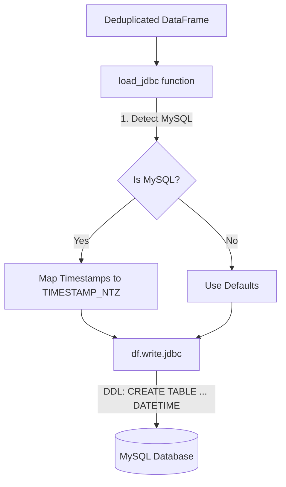

# Requirements

### Overview & Goals
The goal is to fix the `java.sql.SQLSyntaxErrorException: Access denied; you need (at least one of) the SUPER privilege(s) for this operation` error occurring during the JDBC load to MySQL. This error is caused by attempting to set the `explicit_defaults_for_timestamp` system variable at the session level, which is restricted in some MySQL environments.

### Scope
- **In Scope**:
    - Modification of the `load_jdbc` function in `etl_spark.py` to resolve the compatibility issue without requiring `SUPER` privileges.
    - Updating the test suite to verify the new configuration.
- **Out of Scope**:
    - Changing the MySQL server configuration.
    - Modifying the manual `create_tables.sql` script (the pipeline will remain compatible with it).

# Technical Design

### Current Implementation
The pipeline currently uses `sessionVariables=explicit_defaults_for_timestamp=1` in the JDBC properties. This was previously added to fix an `Invalid default value` error caused by MySQL's legacy automatic timestamp behavior. However, setting this variable requires `SUPER` privileges, which are not available to the user.

### Key Decisions
- **Remove Session Variables**: Eliminate the need for `SUPER` privileges by removing the `sessionVariables` property.
- **Use TIMESTAMP_NTZ Mapping**: Map Spark `TimestampType` columns to `TIMESTAMP_NTZ` in the `createTableColumnTypes` property.
    - **Rationale**: In Spark 3.4+, the MySQL dialect maps `TIMESTAMP_NTZ` to the `DATETIME` data type in MySQL. Unlike `TIMESTAMP`, the `DATETIME` type does not trigger automatic default value errors, making it the safer and more compatible choice for modern ETL pipelines on MySQL.

### Proposed Changes
#### `etl_spark.py`
- In `load_jdbc`, identify columns of type `TimestampType` and `DateType`.
- Construct a `createTableColumnTypes` string that explicitly tells Spark to use `TIMESTAMP_NTZ` (for `DATETIME`) and `DATE` for these columns.
- Remove the `sessionVariables` assignment.

#### Data Model Compatibility
 Spark Type | MySQL Type (Current) | MySQL Type (New) | Benefit |
------------|----------------------|------------------|---------|
 `TimestampType` | `TIMESTAMP` | `DATETIME` | No auto-default errors, avoids `SUPER` privilege requirement. |
 `DateType` | `DATE` | `DATE` | Explicit mapping ensures consistency. |

### Architecture Diagram
The change is localized within the Load stage of the ETL process.

# Testing

### Validation Approach
Verification will be performed through unit testing with mocks to ensure the JDBC properties are correctly constructed before being passed to the Spark `DataFrameWriter`.

### Key Scenarios
- **MySQL Connection**: Verify that `createTableColumnTypes` is populated with `TIMESTAMP_NTZ` for all timestamp columns and `sessionVariables` is absent.
- **Non-MySQL Connection**: Verify that no special type mapping is applied (staying with Spark defaults for other databases like PostgreSQL).
- **Truncate Mode**: Ensure that `truncateTable=true` is still correctly set regardless of the database type.

### Test Changes
- **Update**: `tests/test_etl_spark.py` -> `TestLoadJDBC` class.
- **Verification**: Run `python3 -m unittest tests/test_etl_spark.py`.

# Delivery Steps

### ✓ Step 1: Implement DATETIME mapping for MySQL compatibility in load_jdbc
Update `load_jdbc` in `etl_spark.py` to remove the problematic session variables and implement the `DATETIME` mapping.

- Remove `jdbc_properties["sessionVariables"] = "explicit_defaults_for_timestamp=1"`.
- Add logic to identify `TimestampType` and `DateType` columns in the DataFrame.
- Set `jdbc_properties["createTableColumnTypes"]` to map `TimestampType` to `TIMESTAMP_NTZ` (which Spark 3.4+ translates to `DATETIME` in MySQL) and `DateType` to `DATE`.
- Ensure column names are escaped with backticks in the mapping string.

### ✓ Step 2: Update and verify unit tests for JDBC load configuration
Update the test suite to reflect the changes in JDBC property configuration and ensure no regressions.

- Modify `tests/test_etl_spark.py` to update the `TestLoadJDBC` class.
- Update `test_load_jdbc_properties_mysql_session_variables` to `test_load_jdbc_properties_mysql_type_mapping`.
- Assert that `createTableColumnTypes` contains the expected `TIMESTAMP_NTZ` mappings for MySQL.
- Assert that `sessionVariables` is no longer present.
- Run all tests to verify that the pipeline still correctly handles transformations and schema mappings.